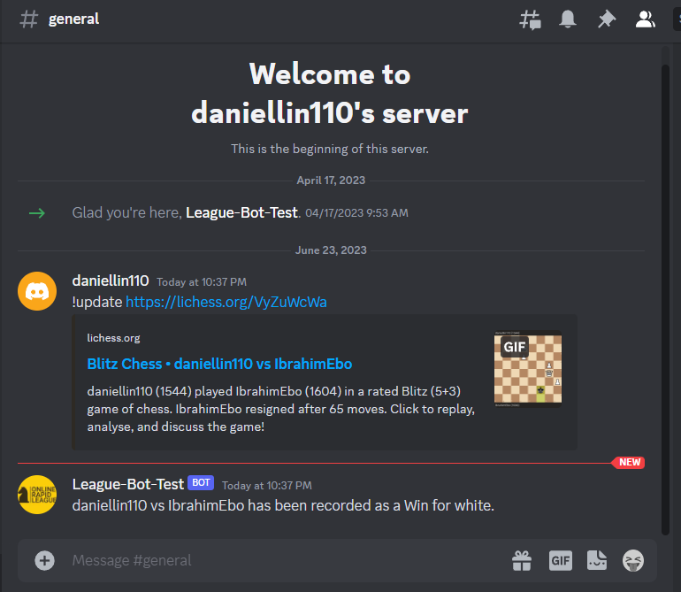
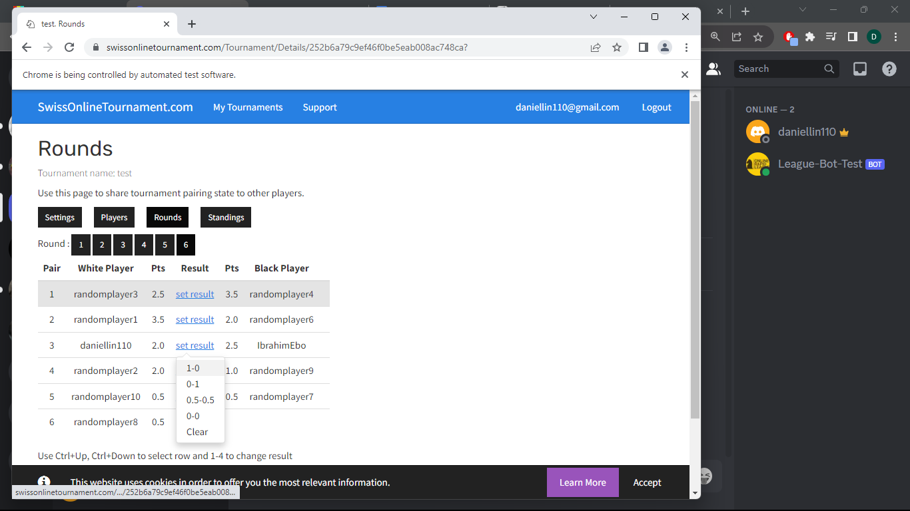

# LeagueBot 
LeagueBot is a Discord bot for chess servers hosting tournaments with swissonlinetournament.com. It takes in a link to a chess game from lichess.org and updates the result on the website.

# Setup:
The token for the Discord bot must be added to config.py. You will also need the login credentials for the organizing SwissOnlineTournament account, as well as a link to the 'Rounds' page of the tournament.

# Use:
To call the bot while it's running, enter the command '!update' followed by the Lichess game link (e.g. !update https://lichess.org/VyZuWcWa). If the given link is valid and the players are matched together in the current round of the tournament, then the result will be added to the website.

